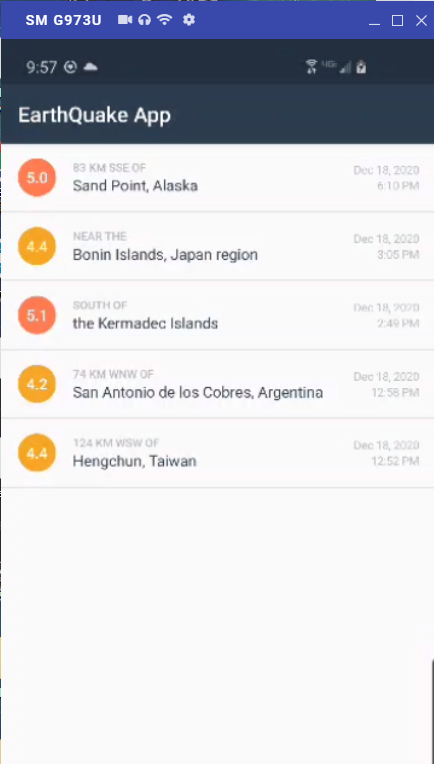
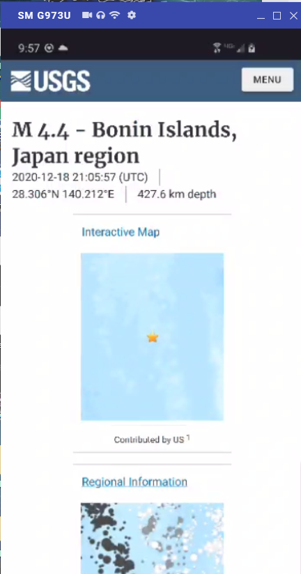
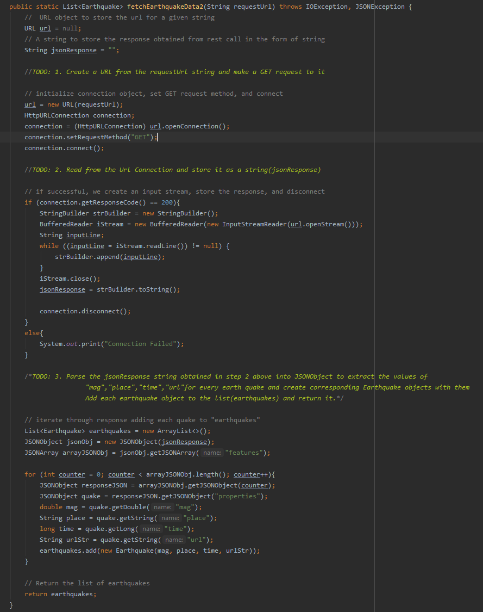
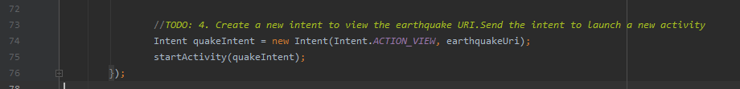

# ICP10 README / WIKI

Description:

In this ICP I created an earthquake app which allows users to see information about different earthquakes including their location, magnitude, and time  

## Earthquake Task

#### Output Screenshot

notes:  
The first page of my application shows a list of earthquakes and the time which they occured on the right side  
The magnitude of each quake is shown in a small bubble on the left side.

#### Earthquake Details Screenshot

notes:  
This screenshot shows an example of what happens after clicking on an earthquake.  
Users are routed to earthquake.USGS.gov for more information

#### Query Utils Java Screenshot

notes:  
Most of the functionality for this app is within queryUtils.java.  

in TODO 1 I established a connection with the usgs.gov website and prepare to make a GET request.    
in TODO 2 I gather the response json into a string object if the connection was successful.    
in TODO 3 I iterate through each item in the JSON response and add its quake information to the list "earthquakes" before returning the earthquakes list.  

#### Earthquake Activity Java Screenshot

in TODO 4 I create quakeIntent and navigate the use to earthquakeUri.