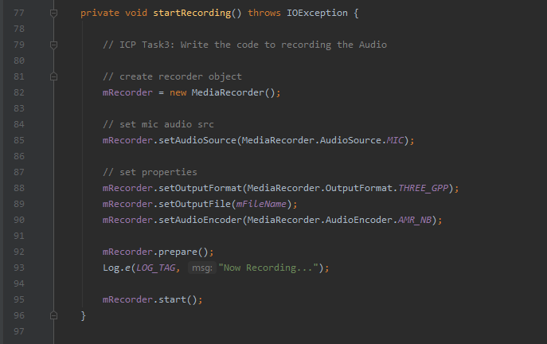

# ICP11 README / WIKI

Description:

In this ICP I learned to use the basic android hardware functionality including Camera, Audio Recording, and Storage capability.  

#### Menu Output Screenshot

notes:  
From this menu, users can access the different android hardware functionality.  

#### Camera Output Screenshot

notes:  
Users can take an image and the application will give a preview.

#### Camera Java Screenshot

notes:  
For this task I had to check if camera permission was enabled, if not I request permission.  

#### Recording Output Screenshot

notes:  
This part of the app can record and playback audio.  

#### AudioRecording Java Screenshot

notes:  
For this task I had to initialize a mediarecorder, set the audio source to microphone, and set a few audio properties.  

#### Storage Output Screenshot

notes:  
The storage functionality will save user input text to a file and then display it back to the user after pressing the open button

#### Storage Java Screenshot

notes:  
The saveTofile function will read what the user has input and write it to the file specified in the global variable FILENAME.  
The retrieveFromFile function is called when the user presses the "Open" button. This function will open the file at FILENAME, read that input into a string, and display it at the bottom of the page.  
