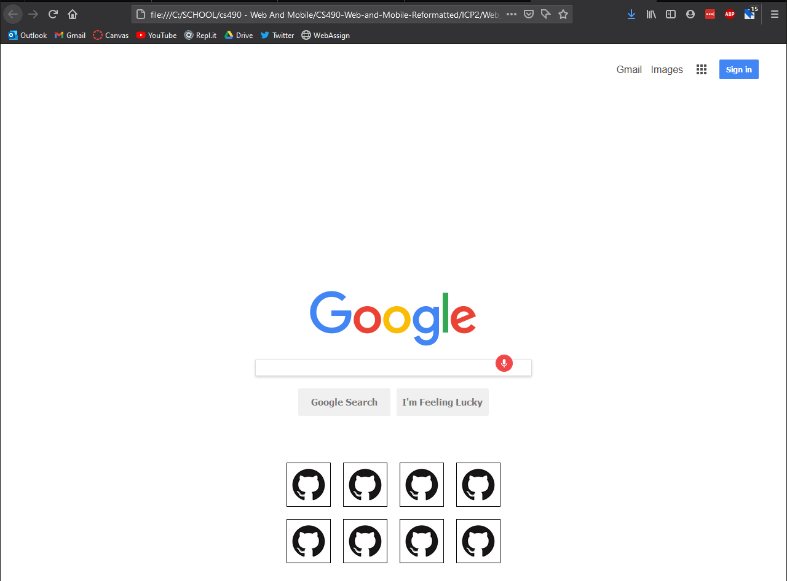

# ICP2 README / WIKI

<b>Description:</b>  
1.) I created an HTML page about succulents incorporating the required elements  
2.) I modified the google homepage to include recent tabs  
3.) I created a web page which displays a 3x3 grid of different colors  

#### output screenshot 1

<i>notes:</i>  
this page contains the required elements  

#### output screenshot 2

<i>notes:</i>  
in this example, all recent pages are github. Clicking on each one sends the user to the github homepage  

#### output screenshot 3

<i>notes:</i>  
color grid  

