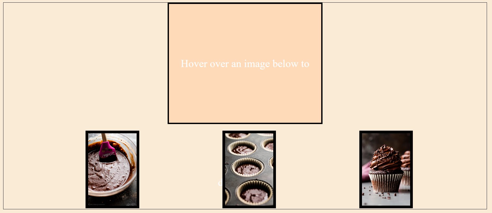
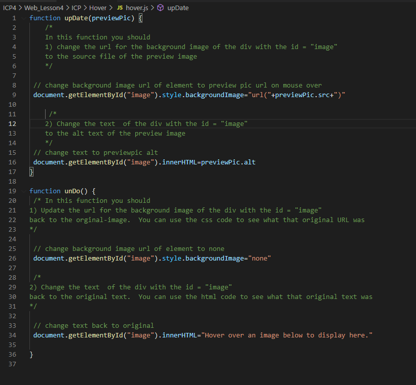
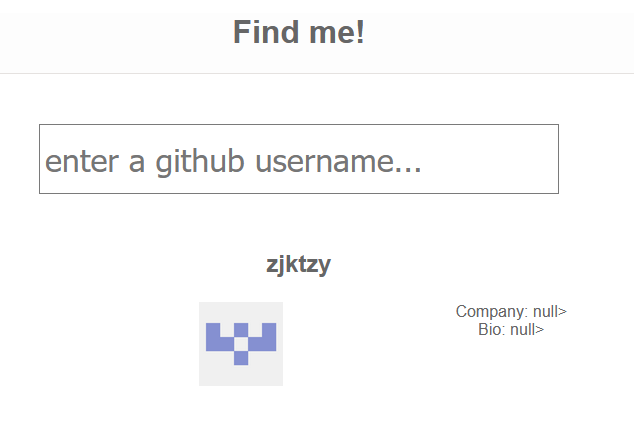
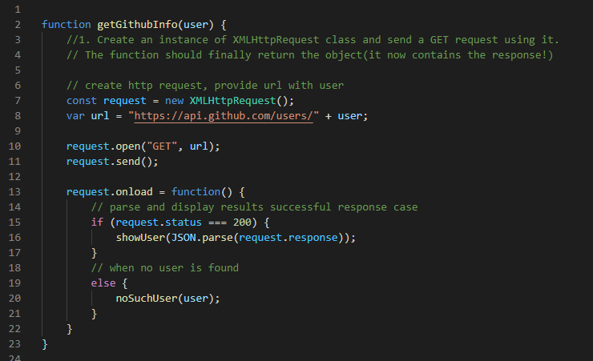
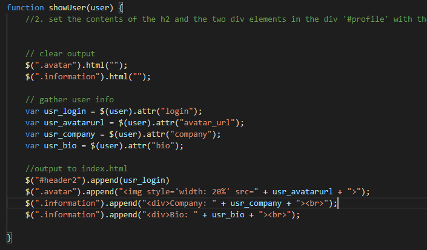
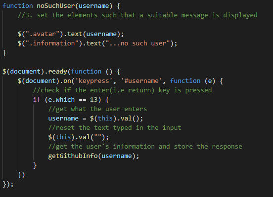

# ICP3 README / WIKI

Description: 

Tasks for this ICP -  

1.) Hover 
    -modify javascript to show baking image on mouse over  

2.) Github User Finder 
    -display image about github users after entering a username  

## Hover Task

### Output Screenshot

notes:  
this is better displayed in my video

### JS Screenshot

notes:  
I call the update function on mouse over of each image along the bottom.  
I call the unDo function on mouseout 

## Github User Finder

### Output Screenshot

notes:  
I display the users name in the h2 header, and their company and bio in two divs tothe right of their avatar. 
In this example, I've used my own github username. 

### getGithubInfo(user) code

notes:  
I was able to replicate most of the elements but struggled to make my name appear on the right side. I think my columns were not set up correctly 

### showUser(user) code

notes:  
I call the showUser function after getting a successful http response. 
This function edits the HTML of index.html to output the github user information 

### noSuchUser(username) code

notes:  
This function simply outputs the user input with a short message "...no such user"

