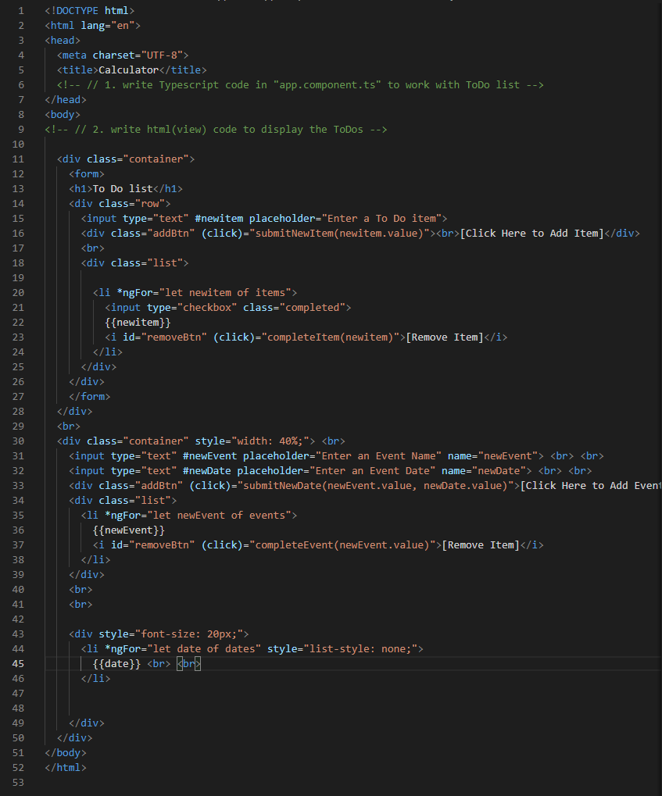

# ICP3 README / WIKI

Description:

In this ICP I created a simple rock paper scissors game using javascript as well as replicated a mockup using html and css

## RPS Task

##### Output Screenshot

notes:  
To Do tasks can be added, removed, and marked complete

##### HTML Screenshot

notes:  
My application consists of two containers, the first holds my To Do input box and list.  
The second container holds the input boxes for new events and a list of timestamps for each event.  

##### To Do TypeScript Screenshot

notes:  
The submitNewItem function simply takes the item input and adds it to the item list.  
The completeItem function finds the index of the given item and 'splices' or removes it from the list.  

##### Countdown TypeScript Screenshot

notes:  
The submitNewDate function adds both the event name and event date to their respective lists.  
The startCountDown function parses the user input date and stores it in a date object. It should also start the countdown for that date, but this part is not functioning.  
The countdown function decrements the date by one second and is meant to be called each second the app is running for each date in the dates list.  