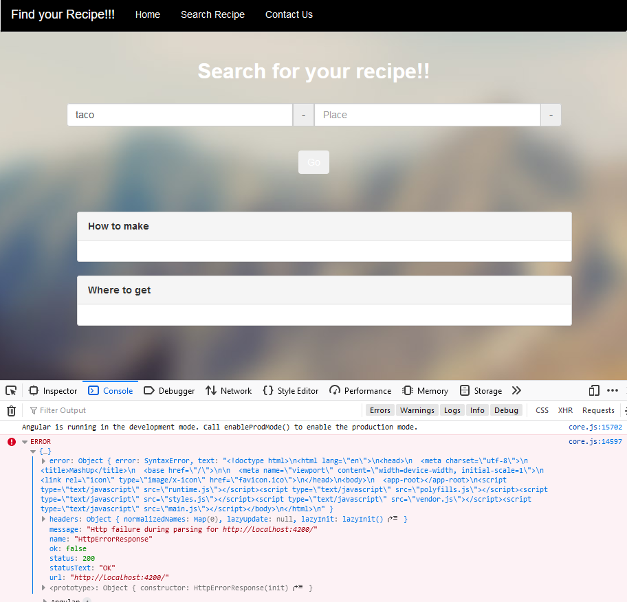
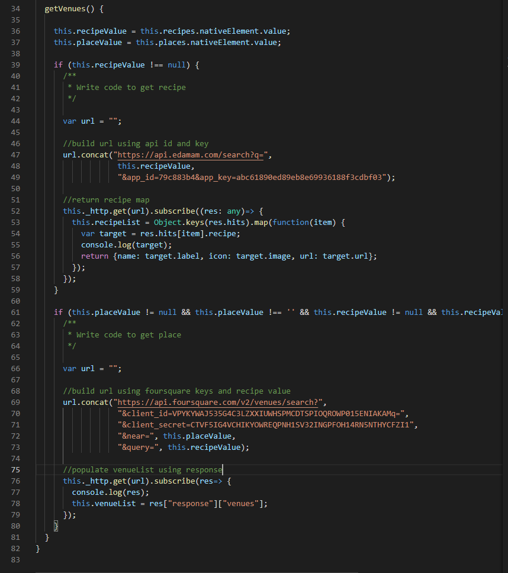

# ICP6 README / WIKI

Description:

In this ICP I created a simple rock paper scissors game using javascript as well as replicated a mockup using html and css

## RPS Task

##### Output Screenshot

notes:  
I ran into issues trying to parse the data

##### Mashup TypeScript Screenshot

notes:  
I dynamically build the api request urls for both edamam and foursquare.  
