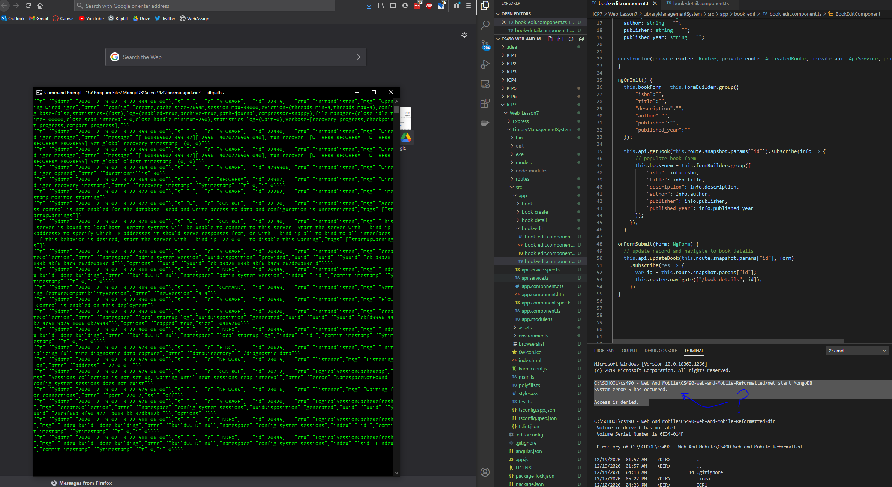

# ICP7 README / WIKI

Description:

In this ICP I was supposed to implement update / delete functionality for a mongodb database. I struggled to get the database working 

## Library Management Task

##### Output Screenshot

notes:  
I followed instructions form the installations powerpoint, but kept getting system error 5 access denied, as shown in the bottom right of the screenshot