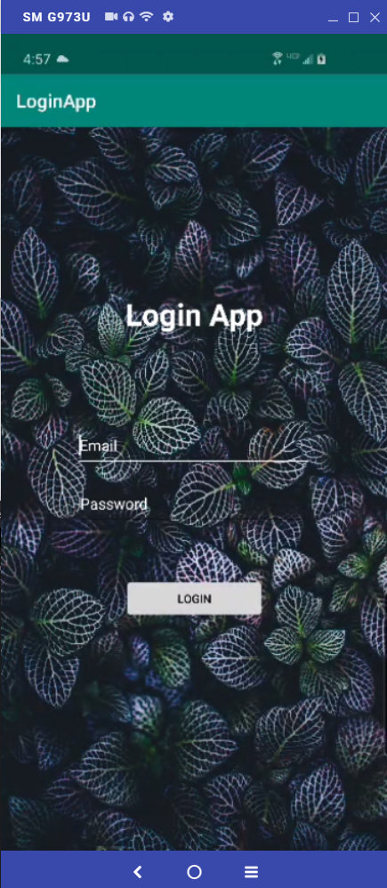
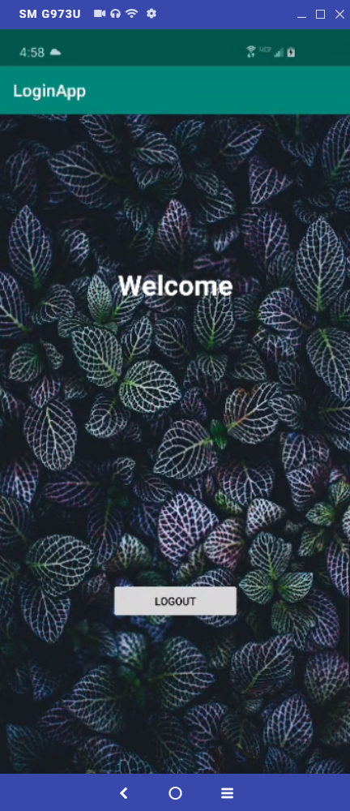
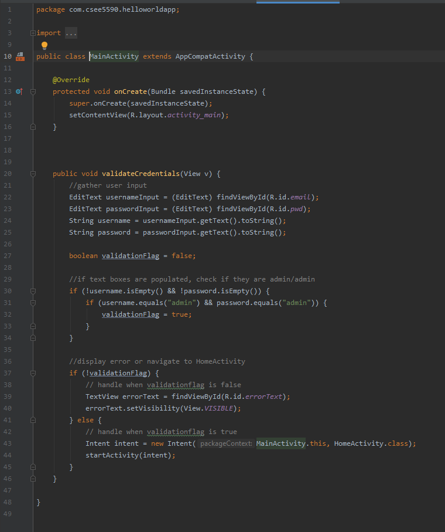
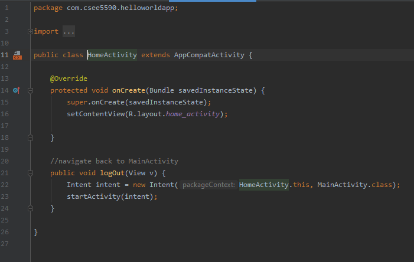

# ICP3 README / WIKI

Description:

In this ICP I created a simple application in which users can log in and log out.

## RPS Task

##### Login Screen Screenshot

notes:  
My login screen is basic and easy to use

##### Welcome Screen Screenshot

notes:  
my welcome screen is essentially a placeholder where an actual activity would go.  
in this case, the user is only able to log out

##### MainActivity Java Screenshot

notes:  
The primary function of this app is validateCredentials. 
This function will check that the user has entered valid credentials and navigate them to the next screen, or provide an error message depending on the validation flag

##### HomeActivity Java Screenshot

notes:  
HomeActivity only has one function which only serves to navigate the user back to the login page.
